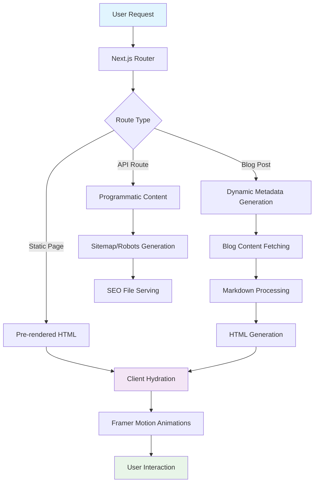

## Table of Contents
1. [Project Overview](#project-overview)
2. [System Architecture](#system-architecture)
3. [Local Development Setup](#local-development-setup)
4. [Codebase Tour](#codebase-tour-directory--file-structure)
5. [Core Modules Deep Dive](#core-modules-deep-dive)
6. [How to Contribute](#how-to-contribute)

---

## 1. Project Overview

### Mission
This is the personal website and portfolio for "Created By Timmy" (Mejabi Durotimi), a multi-disciplinary creative professional based in Limerick, Ireland. The website serves as a digital showcase for photography, videography, event planning, and web development services, while also functioning as a business platform to attract and convert potential clients.

### Core Functionality
- **Portfolio Showcase**: Dynamic galleries for photography and videography work
- **Service Pages**: Detailed descriptions of photography, videography, event planning, and web development services
- **Pricing Information**: Transparent rates and packages for each service
- **Blog Platform**: Content marketing through photography/videography insights and tips
- **Contact & Lead Generation**: Multiple touchpoints for client inquiries
- **SEO Optimization**: Enterprise-level search engine optimization for local Limerick market
- **Responsive Design**: Mobile-first approach with smooth animations

### Tech Stack

#### Core Framework
- **Next.js 15.3.5** - React-based full-stack framework with App Router
- **React 18.3.1** - Frontend library for UI components
- **TypeScript 5** - Type-safe JavaScript development

#### Styling & Animation
- **TailwindCSS v4** - Utility-first CSS framework with custom design system
- **Framer Motion 11.18.2** - Production-ready motion library for React
- **Custom CSS Variables** - Theme system supporting light/dark modes

#### Content Management
- **Markdown + Gray Matter 4.0.3** - File-based content management for blog posts
- **Remark/Rehype** - Markdown processing pipeline with syntax highlighting
- **Static Generation** - Build-time content processing for optimal performance

#### SEO & Analytics
- **Next.js Metadata API** - Built-in SEO optimization
- **Programmatic Sitemap/Robots** - Dynamic SEO file generation
- **JSON-LD Structured Data** - Rich snippets for search engines
- **PostHog** - Product analytics and user behavior tracking

#### Development Tools
- **ESLint 9** - Code linting with Next.js and TypeScript rules
- **Prettier** - Code formatting
- **Husky 9.1.7** - Git hooks for pre-commit linting

---

## 2. System Architecture

### High-Level Design
This is a **Static Site Generation (SSG)** application with **Incremental Static Regeneration (ISR)** capabilities. The architecture follows Next.js App Router patterns with a focus on performance, SEO, and user experience.

```
┌─────────────────┐    ┌──────────────────┐    ┌─────────────────┐
│   Static CDN    │    │   Next.js App   │    │  Content Layer  │
│   (Vercel)      │◄──►│     Router       │◄──►│   (Markdown)    │
│                 │    │                  │    │                 │
│ • Images        │    │ • App Directory  │    │ • Blog Posts    │
│ • CSS/JS        │    │ • API Routes     │    │ • Metadata      │
│ • robots.txt    │    │ • Metadata API   │    │ • Front Matter  │
│ • sitemap.xml   │    │ • Middleware     │    │                 │
└─────────────────┘    └──────────────────┘    └─────────────────┘
```

### Component Breakdown

#### 1. **App Router Structure** (`src/app/`)
- **Pages**: Route-based file structure for all site pages
- **Layout**: Global layout with metadata and analytics
- **API Routes**: Programmatic sitemap and robots generation
- **Metadata**: Dynamic SEO optimization per page

#### 2. **Component Library** (`src/components/`)
- **UI Components**: Reusable Button, Image, and layout components
- **Section Components**: Hero, Services, Testimonials, About sections
- **Blog Components**: BlogPostCard for content display
- **SEO Components**: Metadata and structured data providers

#### 3. **Content Layer** (`content/`)
- **Markdown Files**: Blog posts with front matter metadata
- **Asset Management**: Image optimization and serving

#### 4. **Utility Layer** (`src/lib/`)
- **Blog System**: Content fetching and processing utilities
- **Type Definitions**: TypeScript interfaces for content models

### Data Flow



---

## 3. Local Development Setup

### Prerequisites
Before you begin, ensure you have the following installed:

- **Node.js**: Version 18.0.0 or higher ([Download here](https://nodejs.org/))
- **Yarn**: Version 1.22.0 or higher ([Install guide](https://yarnpkg.com/getting-started/install))
- **Git**: For version control ([Download here](https://git-scm.com/))
- **Code Editor**: VS Code recommended with TypeScript and ESLint extensions

### Installation Steps

#### 1. Clone the Repository
```bash
git clone <repository-url>
cd personal_website
```

#### 2. Install Dependencies
```bash
# Install all dependencies using Yarn PnP
yarn install
```

#### 3. Environment Configuration
Create a `.env.local` file in the root directory:

```bash
# Analytics Configuration
NEXT_PUBLIC_GA_ID=G-GA_KEY
NEXT_PUBLIC_POSTHOG_KEY=your_posthog_key_here
NEXT_PUBLIC_POSTHOG_HOST=https://app.posthog.com

```

**Environment Variables Explained:**
- `NEXT_PUBLIC_GA_ID`: Google Analytics tracking ID for visitor analytics
- `NEXT_PUBLIC_POSTHOG_KEY`: PostHog project key for user behavior tracking
- `NEXT_PUBLIC_POSTHOG_HOST`: PostHog API endpoint

#### 4. Content Setup
The blog content is managed through Markdown files in the `content/` directory. No additional setup is required, but you can add new blog posts by creating `.md` files with the following front matter:

```markdown
---
title: "Your Blog Post Title"
description: "SEO-friendly description"
slug: "url-friendly-slug"
date: "2025-01-10"
coverImage: "/images/blog/your-image.jpg"
tags: ["photography", "tips"]
---

Your blog content here...
```

#### 5. Running the Application

**Development Server:**
```bash
npm run dev
```

**Production Build:**
```bash
npm run build
npm run start
```

**Linting:**
```bash
npm run lint
```

### Verification
Once your setup is complete:

1. **Navigate to** `http://localhost:3000`
2. **You should see** the homepage with "Created By Timmy" branding
3. **Test navigation** to `/photography`, `/videography`, `/blog`
4. **Check SEO routes** at `/robots.txt` and `/sitemap.xml`
5. **Verify responsive design** by resizing the browser window
6. **Test animations** by hovering over buttons and cards

**Success Indicators:**
- ✅ Page loads without console errors
- ✅ Images display correctly with proper alt text
- ✅ Animations work smoothly
- ✅ Blog posts render from markdown files
- ✅ SEO metadata appears in page source

---

## 4. Codebase Tour: Directory & File Structure

```
personal_website/
├── 📁 src/                          # Main application source code
│   ├── 📁 app/                      # Next.js App Router structure
│   │   ├── 📄 layout.tsx            # Global layout with metadata & analytics
│   │   ├── 📄 page.tsx              # Homepage component
│   │   ├── 📄 globals.css           # Global styles and CSS variables
│   │   ├── 📄 robots.ts             # Programmatic robots.txt generation
│   │   ├── 📄 sitemap.ts            # Dynamic sitemap.xml generation
│   │   ├── 📁 blog/                 # Blog section
│   │   │   ├── 📄 page.tsx          # Blog listing page
│   │   │   └── 📁 [slug]/           # Dynamic blog post pages
│   │   │       └── 📄 page.tsx      # Individual blog post with metadata
│   │   ├── 📁 photography/          # Photography service page
│   │   ├── 📁 videography/          # Videography service page
│   │   ├── 📁 event-planning/       # Event planning service page
│   │   ├── 📁 web-development/      # Web development service page
│   │   └── 📁 rates/                # Pricing pages for all services
│   ├── 📁 components/               # Reusable React components
│   │   ├── 📁 ui/                   # Base UI components
│   │   │   └── 📄 Button.tsx        # Reusable button component
│   │   ├── 📄 Hero.tsx              # Homepage hero section
│   │   ├── 📄 ServicesSection.tsx   # Services showcase
│   │   ├── 📄 TestimonialsSection.tsx # Client testimonials
│   │   ├── 📄 Footer.tsx            # Site footer
│   │   ├── 📄 SeoHead.tsx           # SEO metadata component
│   │   └── 📁 blog/                 # Blog-specific components
│   │       └── 📄 BlogPostCard.tsx  # Blog post preview card
│   └── 📁 lib/                      # Utility functions and types
│       └── 📄 blog.ts               # Blog content fetching and processing
├── 📁 content/                      # Markdown content files
│   └── 📄 *.md                      # Blog posts with front matter
├── 📁 public/                       # Static assets
│   ├── 📁 images/                   # Image assets
│   │   ├── 📁 photography/          # Portfolio images
│   │   ├── 📁 testimonials/         # Client photos
│   │   └── 📄 *.jpg                 # Other images
│   ├── 📄 logo.png                  # Site logo
│   ├── 📄 manifest.json             # PWA manifest
│   └── 📄 browserconfig.xml         # Microsoft browser config
├── 📄 package.json                  # Dependencies and scripts
├── 📄 tsconfig.json                 # TypeScript configuration
├── 📄 tailwind.config.js            # TailwindCSS configuration
├── 📄 eslint.config.mjs             # ESLint rules and settings
├── 📄 next.config.ts                # Next.js configuration
└── 📄 README.md                     # Project overview
```

### Critical Files Explained

#### **`src/app/layout.tsx`** - Global Application Layout
The root layout that wraps all pages with:
- Global metadata and SEO configuration
- Google Analytics and PostHog integration
- CSS variables for theming
- JSON-LD structured data for business information

#### **`src/lib/blog.ts`** - Content Management System
Core utilities for the blog system:
- `getAllPosts()`: Fetches all blog posts with metadata
- `getPostBySlug()`: Retrieves individual blog post content
- Markdown processing with syntax highlighting
- TypeScript interfaces for blog post types

#### **`tailwind.config.js`** - Design System Configuration
TailwindCSS configuration defining:
- Custom color scheme
- Typography scales
- Spacing system
- Responsive breakpoints

#### **`src/app/sitemap.ts` & `src/app/robots.ts`** - SEO Infrastructure
Programmatic SEO file generation:
- Dynamic sitemap including all static pages and blog posts
- Robots.txt with proper bot permissions and sitemap references
- Enterprise-level SEO optimization

---

## 5. Core Modules Deep Dive

### 1. **Blog System** (`src/lib/blog.ts` + `src/app/blog/`)

#### Purpose
Provides a file-based content management system for blog posts using Markdown files with front matter metadata.

#### Key Files & Logic
- **`src/lib/blog.ts`**: Core content processing utilities
- **`src/app/blog/page.tsx`**: Blog listing page with post previews
- **`src/app/blog/[slug]/page.tsx`**: Dynamic blog post pages with SEO metadata

#### Inputs & Outputs
- **Input**: Markdown files in `/content/` directory with YAML front matter
- **Output**: Processed HTML content with metadata for React components

#### Interactions
- Integrates with Next.js metadata API for SEO
- Connects to sitemap generation for automatic URL inclusion
- Uses Remark/Rehype pipeline for markdown processing

### 2. **SEO Infrastructure** (`src/app/sitemap.ts`, `src/app/robots.ts`, metadata)

#### Purpose
Provides enterprise-level search engine optimization with dynamic content generation and comprehensive metadata management.

#### Key Files & Logic
- **`src/app/sitemap.ts`**: Programmatic sitemap generation
- **`src/app/robots.ts`**: Dynamic robots.txt creation
- **`src/app/layout.tsx`**: Global metadata and structured data
- **`src/app/blog/[slug]/page.tsx`**: Dynamic blog post metadata

#### Inputs & Outputs
- **Input**: Static page routes and dynamic blog content
- **Output**: SEO-optimized XML sitemaps, robots.txt, and HTML metadata

#### Interactions
- Integrates with blog system for dynamic content inclusion
- Connects to Next.js Metadata API for automatic head tag generation
- Works with structured data for rich search results


### 3. **Component System** (`src/components/`)

#### Purpose
Provides a reusable, type-safe component library with consistent styling and animation patterns.

#### Key Files & Logic
- **`src/components/ui/Button.tsx`**: Base button component with variants
- **`src/components/Hero.tsx`**: Homepage hero with navigation
- **`src/components/ServicesSection.tsx`**: Service showcase with animations
- **`src/components/blog/BlogPostCard.tsx`**: Blog post preview cards

#### Inputs & Outputs
- **Input**: TypeScript props with strict type definitions
- **Output**: Accessible React components with Framer Motion animations

#### Interactions
- Uses TailwindCSS for styling with CSS variables
- Integrates Framer Motion for smooth animations
- Connects to Next.js Image component for optimization

### 4. **Animation System** (Framer Motion Integration)

#### Purpose
Provides smooth, performant animations throughout the application using Framer Motion.

#### Key Files & Logic
- **All page components**: Entry animations and scroll-triggered animations
- **`src/components/ServicesSection.tsx`**: Staggered card animations
- **Interactive components**: Hover and tap animations

#### Inputs & Outputs
- **Input**: Motion variants and animation triggers
- **Output**: Smooth UI animations with accessibility considerations

#### Interactions
- Respects `prefers-reduced-motion` for accessibility
- Integrates with component lifecycle for performance
- Uses IntersectionObserver for scroll-triggered animations

### 5. **Image Optimization System** (Next.js Image + Alt Text Management)

#### Purpose
Provides optimized image delivery with comprehensive accessibility through descriptive alt text.

#### Key Files & Logic
- **All components using images**: Proper alt text implementation
- **`public/images/`**: Organized image assets by category
- **SEO-optimized alt text**: Location and service-specific descriptions

#### Inputs & Outputs
- **Input**: Image assets and contextual information
- **Output**: Optimized images with accessibility compliance

#### Interactions
- Next.js Image component for automatic optimization
- TailwindCSS for responsive image styling
- SEO metadata for social media sharing

---

## 6. How to Contribute

### Testing Strategy

**Current State**: This project currently focuses on type safety through TypeScript rather than traditional unit testing. However, testing infrastructure can be added.

**Manual Testing Checklist**:
- ✅ All pages load without console errors
- ✅ Responsive design works across devices
- ✅ Images have proper alt text
- ✅ Blog posts render correctly from markdown
- ✅ SEO metadata appears in page source
- ✅ Animations work smoothly
- ✅ Links navigate correctly

### Coding Style

#### ESLint Configuration
```bash
# Lint all files
yarn lint

# Lint with auto-fix
yarn lint --fix
```

**ESLint Rules** (see `eslint.config.mjs`):
- Next.js recommended rules
- TypeScript strict mode
- Unused imports removal
- Accessibility checks (jsx-a11y)

#### Code Formatting
The project uses ESLint for both linting and formatting. Key principles:

- **TypeScript First**: All components must be typed
- **Accessibility**: All images need descriptive alt text
- **Performance**: Use Next.js Image component for all images
- **SEO**: Include proper metadata for all pages
- **Animation**: Use Framer Motion for all animations

#### Pre-commit Hooks
Husky automatically runs linting on commit:
```bash
# This runs automatically on git commit
lint-staged
```

### Branching & Pull Request Workflow

#### Branch Naming Convention
```bash
# Feature branches
git checkout -b feature/add-testimonials-section

# Bug fixes
git checkout -b fix/image-alt-text-accessibility

# SEO improvements
git checkout -b seo/structured-data-enhancement
```

#### Pull Request Process

1. **Create Feature Branch**
   ```bash
   git checkout -b feature/your-feature-name
   ```

2. **Development**
   - Make your changes
   - Test locally (`yarn dev`)
   - Run linting (`yarn lint`)
   - Build successfully (`yarn build`)

3. **Commit Guidelines**
   ```bash
   # Use conventional commit format
   git commit -m "feat: add new testimonials section with animations"
   git commit -m "fix: improve image alt text for accessibility"
   git commit -m "seo: add structured data for services"
   ```

4. **Pre-PR Checklist**
   - [ ] All TypeScript errors resolved
   - [ ] ESLint passes without warnings
   - [ ] Build completes successfully
   - [ ] All images have descriptive alt text
   - [ ] Responsive design tested
   - [ ] SEO metadata added for new pages

5. **Pull Request Template**
   ```markdown
   ## Description
   Brief description of changes
   
   ## Type of Change
   - [ ] Bug fix
   - [ ] New feature
   - [ ] SEO improvement
   - [ ] Performance optimization
   
   ## Testing
   - [ ] Tested locally
   - [ ] Responsive design verified
   - [ ] Accessibility checked
   - [ ] SEO metadata validated
   
   ## Screenshots
   (If applicable)
   ```

### Development Best Practices

#### Component Development
- Use TypeScript interfaces for all props
- Include JSDoc comments for complex components
- Follow the existing component structure in `src/components/`
- Use CSS variables for theming consistency

#### SEO Considerations
- Add metadata for all new pages
- Include structured data where appropriate
- Use semantic HTML elements
- Ensure proper heading hierarchy (h1 → h2 → h3)

#### Performance Guidelines
- Use Next.js Image component for all images
- Implement lazy loading for non-critical content
- Optimize animations with `will-change` CSS property
- Test Core Web Vitals with Lighthouse

#### Accessibility Requirements
- All images must have descriptive alt text
- Use semantic HTML elements
- Ensure keyboard navigation works
- Test with screen readers when possible
- Maintain color contrast ratios

---

## Getting Help

### Common Issues

**Build Errors**: Run `yarn install` and `rm -rf .next` then `yarn build`

**TypeScript Errors**: Check `tsconfig.json` and ensure all imports have proper types

**Styling Issues**: Verify TailwindCSS configuration and CSS variable usage

**SEO Problems**: Check metadata in page components and verify sitemap generation

### Resources

- [Next.js Documentation](https://nextjs.org/docs)
- [TailwindCSS Documentation](https://tailwindcss.com/docs)
- [Framer Motion Documentation](https://www.framer.com/motion/)
- [TypeScript Handbook](https://www.typescriptlang.org/docs/)

### Contact

For questions specific to this codebase, refer to the commit history and existing code patterns. The codebase is well-documented through TypeScript types and component structure.

---

**Welcome to the team! 🎉** This documentation should give you everything you need to get started. The codebase prioritizes type safety, accessibility, SEO optimization, and performance – principles that should guide all future development. 